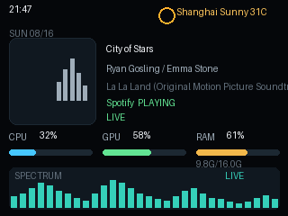

# HoloCubic PC Overview（中文文档）

把 320x240 的 HoloCubic 变成一块 PC 状态屏：显示正在播放的音乐、CPU/GPU/内存占用、本地天气、时间和实时频谱。



## 功能

- SMTC 音乐信息：歌名、歌手、专辑、播放器名称
- 96x96 RGB565 专辑封面，切歌后先刷新文字、再异步刷新封面
- CPU、GPU、内存占用，每秒更新，采样不阻塞主循环
- 本地天气：复用设备内置 CubicServer 天气接口
- 时间和日期，支持时区配置
- 实时频谱：32 个频段柱状图，通过 UDP 发送 32 字节数据，设备端本地绘制
- SPW（Salt Player for Windows）插件：提供精确曲目元数据和音频文件路径

## 目录结构

```text
holocubic-pc-overview/
  package/        设备端 Lua 应用，部署到 /sd/apps/pc_overview/
  service/        Windows 桥接服务（SMTC、系统指标、WASAPI 频谱）
  spw-plugin/     Salt Player for Windows 插件原型
  docs/           协议、性能、SPW 集成文档
  README.md       英文说明
  README_ZH.md    本文档
```

## 安装

### 设备端

1. 把 `package/` 目录复制到 `/sd/apps/pc_overview/`。
2. 确保 `weather` 应用已安装。本应用会借用它的中文字体和日文字体
   （`/sd/apps/weather/font/weather_ui_zh_cn_*.bin`、
   `weather_ui_ja_*.bin`），否则中文/日文/特殊符号无法显示。
3. 在启动器中重新扫描应用，打开 `PC Overview`。
4. 打开 WebUI `http://<holocubic-ip>/pc-overview/`，填写 PC 的 IP 和桥接端口。

### Windows 端

桥接需要 Windows 10/11 和 Windows PowerShell 5.1（`powershell.exe`）：

```text
service\start_bridge.bat
```

`-ServiceMode` 是推荐的后台模式：桥接随系统登录自启，只启动 CPU/GPU/内存
监控；音乐信息和频谱会等到 Salt Player for Windows 运行后再自动开启。
SPW 退出后，频谱停止，音乐信息清空，系统指标继续工作。

注册/取消开机自启：

```powershell
powershell.exe -NoProfile -ExecutionPolicy Bypass -File service\register-startup.ps1
powershell.exe -NoProfile -ExecutionPolicy Bypass -File service\register-startup.ps1 -Unregister
```

脚本会在启动文件夹创建一个隐藏启动项，登录后自动运行：

```text
powershell.exe -File pc_bridge.ps1 -ServiceMode
```

使用系统自启时，建议设置 `PC_OVERVIEW_AUTOSTART_BRIDGE=false`，避免 SPW
插件再拉起一个重复的桥接进程。

默认监听 `0.0.0.0:8088`，主要接口：

```text
http://<pc-ip>:8088/         浏览器调试页
http://<pc-ip>:8088/state    JSON 状态
http://<pc-ip>:8088/cover    RGB565 封面字节
ws://<pc-ip>:8088/ws        状态和频谱 WebSocket
```

需要在 Windows 防火墙中放行 8088（专用网络）。音乐软件需要提供 SMTC
元数据，绝大多数桌面播放器都支持。

### SPW 插件（可选）

把 `spw-plugin/build/plugin-SPWPCOverview-0.1.0.zip` 导入 SPW：

```text
SPW -> 设置 -> Workshop -> 模组管理 -> 导入
```

启用插件后：

- 插件在 `127.0.0.1:8091` 提供 `/api/media` 和 `/api/cover`
- 插件会在切歌时调用桥接的 `/salt-media-changed`，桥接立即唤醒
- 设置环境变量 `PC_OVERVIEW_BRIDGE_DIR` 指向 `service/` 目录后，
  插件可以随 SPW 自动启动桥接

## 架构与原理

系统分成三层：

```text
SPW 插件 / SMTC ----------> Windows 桥接 ----------> HoloCubic
  曲目元数据、文件路径       HTTP/WS/UDP               Lua 绘制
  播放事件                  频谱计算、系统指标         天气、时间
```

### 媒体信息链路

1. 桥接优先从 SPW 插件读取 `/api/media`，拿到标题、歌手、专辑、播放状态和
   音频文件完整路径；插件不可用时回退到 Windows SMTC。
2. 切歌是事件驱动的：SPW 插件调用 `/salt-media-changed`，桥接立刻唤醒主
   循环；即使没有插件，也会以 100ms 轮询兜底。
3. 桥接发现曲目变化后，先把新的标题/歌手/专辑推给设备，再异步解析封面。
4. 设备收到 `cover_ready=false` 时保留上一张封面并快速重试；桥接解析完成
   后推送 `cover_ready=true`，设备才刷新为新封面。

这样设计是因为封面解析可能很慢（例如无内嵌封面的 WAV 需要 ffmpeg 兜底），
但不能让文字更新等封面。

### 封面解析顺序

```text
SPW 插件 JAudioTagger（进程内，约 20-70ms）
  -> ffmpeg 从音频文件提取
  -> WinRT 文件缩略图
  -> SMTC 会话缩略图
```

桥接把封面统一转成 96x96 RGB565，通过 `/cover64` 或 `/cover` 下发。

### 系统指标

- 内存：直接读取 WMI `Win32_OperatingSystem`
- CPU/GPU：优先使用 C# `PerformanceCounter`，秒级读取一次，不阻塞主循环
- 如果性能计数器 API 不可用，会启动隐藏的 `metrics_sampler.ps1`，在后台
  每秒采样一次并写入临时文件，桥接只读取最新值

### 频谱链路

早期版本直接把整幅频谱画面（300x46 RGB565，约 27.6KB/帧）通过
WebSocket 推给设备，50fps 时约 1.4MB/s，设备端和桥接都卡顿。

当前版本：

```text
WASAPI 环回采集（48kHz）
  -> 1024 点、50% 重叠的 FFT 缓冲区
  -> 32 个对数分布的 Goertzel 频段（60Hz - 16kHz）
  -> 峰值/RMS 自适应归一化 + 指数平滑
  -> 32 字节 UDP 数据报发到 8090 端口
```

设备收到 32 个柱状值后在本地画柱状图，网络开销极小。WebSocket 二进制帧
保留作为 UDP 丢包兜底。当 SPW 运行时，桥接使用 Windows 进程环回 API
只采集 `Salt Player for Windows` 进程树的音频，避免其他系统声音混入。

## 配置项

设备端 `package/config.lua`：

```lua
config.host = "192.168.1.100"    -- PC 桥接 IP
config.port = 8088               -- 桥接 HTTP/WS 端口
config.udp_port = 8090           -- 频谱 UDP 端口
config.cover = true              -- 是否显示封面
config.spectrum = true           -- 是否显示频谱
config.refresh_ms = 33           -- 轻量状态刷新间隔
config.full_refresh_ms = 500     -- 全屏重绘间隔
config.weather_location = ""     -- 天气位置
config.timezone = "CST-8"        -- 时区
```

桥接启动参数（`pc_bridge.ps1`）：

```text
-Port 9000                改 HTTP/WS 端口
-UdpPort 9001             改 UDP 频谱端口
-CoverSize 96             封面尺寸
-SaltPluginUrl URL        启用 SPW 插件媒体源
-ServiceMode              系统自启模式：仅系统指标常驻，SPW 运行后开启音乐/频谱
-SmtcFallback             在 ServiceMode 下允许回退到 SMTC（默认关闭）
-SpectrumProcessName 名称 指定要采集的进程名
-NoSpectrum               关闭频谱采集
-SelfTest                 自检 RGB565 转换后退出
```

ServiceMode 下桥接会以 1 秒间隔检测 SPW 进程和插件 API：检测到后启动
进程环回频谱并切换到插件媒体源；SPW 退出后停止频谱并清空音乐状态。

## 协议摘要

### 桥接 HTTP API

| 接口 | 说明 |
| --- | --- |
| `/state` | JSON 状态（媒体、系统占用、cover_version、cover_ready） |
| `/spectrum` | 最新频谱 JSON |
| `/cover` | 原始 RGB565 封面 |
| `/cover64` | base64 封面包 JSON |
| `/health` | 健康检查、客户端数、频谱计数 |

### 状态字段

状态 JSON 的关键字段：

```json
{
  "type": "state",
  "title": "BLADE",
  "artist": "ELFL",
  "album": "Stellaris",
  "app": "Salt Player for Windows",
  "playing": true,
  "status": "Playing",
  "cpu": 87,
  "gpu": 100,
  "mem": 58,
  "cover_version": 1,
  "cover_ready": true
}
```

`cover_version` 是封面的版本号；`cover_ready=false` 表示桥接还在解析新封面，
设备应保留旧封面。

### 设备 WebUI API

| 接口 | 说明 |
| --- | --- |
| `/pc-overview/api/state` | 当前应用配置和运行计数 |
| `/pc-overview/api/save` | 保存桥接和显示设置 |

## 性能优化记录

### 为什么频谱只用 32 字节

```text
27,600 字节/帧（整幅频谱画面） -> 32 字节/帧（柱状值）
```

设备端在 20ms 定时器里只重绘频谱画布，配合 `full_refresh_ms=500`
控制全屏重绘，ESP32 的 Lua 运行时不至于过载。

### 切歌延迟优化

此前的问题是：

1. 封面解析同步阻塞在文字推送之前，WAV 等文件可能拖慢几百毫秒
2. 设备端封面请求失败后固定等 5 秒重试
3. `Get-Counter -SampleInterval 1` 每次阻塞桥接主循环约 1 秒

现在的做法：

- 文字先推、封面后推，封面的慢解析不再拖住文字
- 设备端 250ms 快速重试，只有 `cover_ready` 后才清除旧封面
- 系统指标采样不再阻塞主循环

## 开发指南

### 修改设备端界面

`package/main.lua`：

- `draw_*` 系列函数负责各区域绘制
- `C` 表是配色
- `S` 表保存运行时状态
- `redraw()` 是全屏重绘入口

改完通过 DevTools 上传到 `/sd/apps/pc_overview/main.lua` 后执行
`POST /devtools/api/reload`，设备会重新加载应用。

### 修改桥接

`service/pc_bridge.ps1`：

- `Update-Media`：读取媒体信息，检测曲目变化
- `Resolve-Cover`：解析封面并设置 `cover_ready`
- `Push-State`：组装状态并推送
- `Update-SystemMetrics`：读取 CPU/GPU/内存

`service/bridge_server.cs`：

- `BridgeServer`：HTTP/WebSocket/UDP 服务端
- `FastMetrics`：轻量性能计数器采样

`service/audio_capture.cs`：

- `LoopbackSpectrum`：WASAPI 环回/进程环回采集和频谱计算

### 修改 SPW 插件

`spw-plugin/src/com/czw/pcoverview/spw/`：

- `SpwPlaybackExtension`：播放回调，切歌时通知桥接
- `PlaybackState`：当前媒体状态
- `CoverExtractor`：用 JAudioTagger 提取内嵌封面
- `HttpApiServer`：`/api/media` 和 `/api/cover`

运行 `spw-plugin/build.ps1` 重新打包，然后在 SPW 中导入新的 zip。

### 自测

```powershell
powershell.exe -NoProfile -ExecutionPolicy Bypass -File service\pc_bridge.ps1 -SelfTest -NoSpectrum -Port 8089
```

输出 `SELFTEST_OK 18432` 表示封面 RGB565 转换正常。

## 常见问题

### 中文、日文、特殊符号显示不出来

需要安装 `weather` 应用，并确认 `/sd/apps/weather/font/` 下有
`weather_ui_zh_cn_*.bin` 和 `weather_ui_ja_*.bin`。

### 封面不刷新

- 确认桥接日志（`%TEMP%\spw-pc-overview-bridge-debug.log`）里有
  `cover_ms` 和 `ok=True`
- 设备 WebUI 的 `cover_ready` 应为 `true`
- 切歌后文字应立即变化；封面在 `cover_ready` 变 true 后跟随

### 频谱卡顿

- 检查桥接健康页的 `spectrum_sent` 是否稳定增长
- 检查频谱是否用了系统默认输出以外的音频设备
- 确认 `refresh_ms` 不要低于 30

### 看不到 CPU/GPU

- 检查桥接 `/state` 是否有非零的 `cpu`/`gpu`
- `metrics_sampler.ps1` 会在性能计数器不可用时自动工作
- 确认防火墙允许 8088 端口

## 相关文档

- [docs/PROTOCOL.md](docs/PROTOCOL.md)：协议细节
- [docs/PERFORMANCE.md](docs/PERFORMANCE.md)：性能优化记录
- [docs/SPW_INTEGRATION.md](docs/SPW_INTEGRATION.md)：SPW 集成研究
- [service/README.md](service/README.md)：桥接运行说明
- [spw-plugin/README.md](spw-plugin/README.md)：SPW 插件说明

## License

MIT
